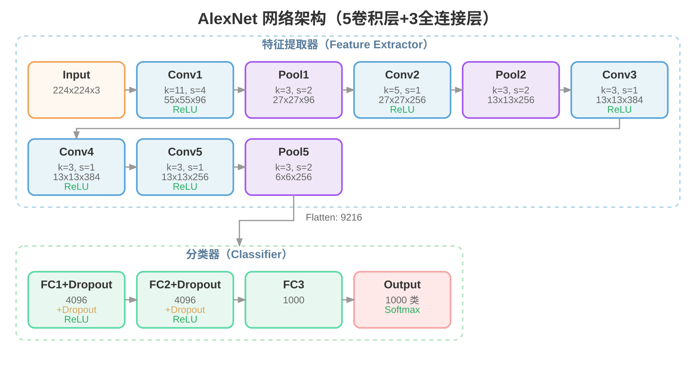

# 神经网络架构可视化工具

一个纯前端的神经网络架构可视化工具，输入 YAML 格式的网络定义，生成美观的 SVG 架构图。

## 效果展示



## 功能特性

- ✅ 支持多种层类型：Input、Conv、Pool、FC、Output、Embedding、Attention 等
- ✅ 支持复杂拓扑结构：残差块（Residual）、并行块（Parallel）、重复块（Stack）
- ✅ 支持多种布局：水平、垂直、自动换行
- ✅ 支持分组显示（Sections）
- ✅ 预置模板：AlexNet、VGG16、ResNet18、Transformer、GoogLeNet、Inception Module
- ✅ 纯前端实现，无需后端依赖
- ✅ 支持外部 API 调用

## 文件结构

```
nn-arch/
├── index.html          # 主页面（编辑器 + 预览）
├── src/                # 源代码目录
│   ├── styles.css      # CSS 样式
│   ├── app.js          # 主逻辑（页面交互）
│   ├── parser.js       # YAML 解析器
│   ├── layout.js       # 布局算法
│   ├── svg-generator.js # SVG 生成器
│   ├── templates.js    # 预置模板
│   ├── nn-arch.js      # 外部调用 API
│   └── lib/
│     └ js-yaml.min.js  # YAML 解析库（本地）
└── tests/              # 测试文件
```

## 使用方式

### 方式一：npm 安装

```bash
npm install @icyfenix-dmla/nn-arch
```

在 Node.js 中使用：

```javascript
const NNArch = require('@icyfenix-dmla/nn-arch');

// 从 YAML 生成 SVG
const yaml = `
name: SimpleNet
layout: horizontal
layers:
  - {name: Input, type: input, size: "224x224x3"}
  - {name: Conv1, type: conv, kernel: 3, channels: 64, act: ReLU}
  - {name: Output, type: output, size: 10}
`;
const svg = NNArch.generateFromYaml(yaml);

// 从预置模板生成
const vggSvg = NNArch.generateFromTemplate('vgg16');
```

### 方式二：直接打开网页

在浏览器中打开 `index.html`，即可使用可视化界面：

1. 在 YAML 编辑器中输入网络定义
2. 点击"生成 SVG"按钮
3. 在预览区域查看生成的架构图
4. 使用 +/- 按钮调整缩放比例
5. 点击"下载 SVG"保存文件

### 方式三：外部 API 聃用（浏览器）

在你的网页中引入相关文件后，调用 `NNArch` 对象的方法：

```html
<!-- 引入依赖 -->
<script src="src/lib/js-yaml.min.js"></script>
<script src="src/parser.js"></script>
<script src="src/layout.js"></script>
<script src="src/svg-generator.js"></script>
<script src="src/templates.js"></script>
<script src="src/nn-arch.js"></script>

<!-- 使用 API -->
<script>
  // 从 YAML 生成 SVG
  const yaml = `
name: SimpleNet
layout: horizontal
layers:
  - {name: Input, type: input, size: "224x224x3"}
  - {name: Conv1, type: conv, kernel: 3, channels: 64, act: ReLU}
  - {name: Output, type: output, size: 10}
`;
  const svg = NNArch.generateFromYaml(yaml);
  document.getElementById('container').innerHTML = svg;

  // 从预置模板生成
  const vggSvg = NNArch.generateFromTemplate('vgg16');

  // 下载 SVG
  NNArch.downloadSvg(svg, 'MyNetwork');
</script>
```

### API 方法

| 方法 | 参数 | 返回值 | 说明 |
|------|------|--------|------|
| `generateFromYaml(yamlText)` | YAML 文本 | SVG 字符串 | 从 YAML 生成 SVG |
| `generateFromTemplate(key)` | 模板键名 | SVG 字符串 | 从预置模板生成 |
| `getTemplateList()` | 无 | 数组 | 获取可用模板列表 |
| `getTemplateYaml(key)` | 模板键名 | YAML 文本 | 获取模板 YAML |
| `downloadSvg(svg, filename)` | SVG、文件名 | 无 | 下载 SVG 文件 |

**可用模板：** `alexnet`, `vgg16`, `resnet18`, `transformer`, `googlenet`, `inception_module`

## YAML 格式说明

### 基本结构

```yaml
name: 网络名称
layout: horizontal | vertical    # 布局方式（可选，默认 horizontal）

sections:                        # 分组区域（可选）
  - name: 特征提取器
    layers: [Input, Conv1, Conv2]
    row_label: "Flatten: 9216"   # section 后的标注（可选）

layers:                          # 所有层定义
  - {name: Input, type: input, size: "224x224x3"}
  - {name: Conv1, type: conv, kernel: 11, stride: 4, channels: 96, out: "55x55x96", act: ReLU}
  - {name: Pool1, type: pool, kernel: 3, stride: 2, out: "27x27x96"}
  - {name: FC1, type: fc, size: 4096, act: ReLU, dropout: true}
  - {name: Output, type: output, size: 1000, act: Softmax}
```

### 支持的层类型

| 类型 | 必要参数 | 可选参数 |
|------|----------|----------|
| `input` | `size` | - |
| `conv` | `kernel`, `channels` | `stride`, `out`, `act`, `pool` |
| `pool` | `kernel` | `stride`, `out`, `type` |
| `fc` | `size` | `act`, `dropout` |
| `output` | `size` | `act` |
| `embedding` | `size` | - |
| `attention` | `heads` | `type` |
| `note` | - | `name`（显示的文本内容），`label`（额外提示信息） |

#### note 类型说明

`note` 类型用于在架构图中添加注释说明：
- 使用虚线边框，灰色填充
- 显示 `name` 属性的文本内容（斜体样式）
- 可选 `label` 参数显示额外提示信息（在 name 下方，灰色小字）
- **不参与数据流连接**，无箭头连接到其他层

```yaml
# 在 output 后添加注释说明
layers_after_blocks:
  - {id: output, name: Output, type: output, size: "28x28x256"}
  - {id: note, name: "用于下一阶段输入", type: note, label: "Batch=128"}

# 带 label 的注释示例
layers:
  - {id: input, name: Input, type: input, size: "224x224x3"}
  - {id: note1, name: "预处理", type: note, label: "归一化 + 随机裁剪"}
```

### 支持的块类型

除了基本层类型外，还支持复杂的拓扑结构块：

| 类型 | 说明 | 必要参数 |
|------|------|----------|
| `residual` | 残差块：主路径 + 跳跃连接 | `main` |
| `parallel` | 并行块：多个分支并行执行 | `branches` |
| `stack` | 重复块：层结构的多次重复 | `layers`, `repeat` |

#### 块属性说明

| 属性 | 适用类型 | 说明 |
|------|----------|------|
| `style` | residual | 布局样式：`arc`（弧形）或 `parallel`（并行） |
| `expand` | stack | 是否全部展开：`true` 显示每层，`false` 显示简化形式 |
| `main` | residual | 主路径层列表 |
| `branches` | parallel | 分支层列表（单层对象或多层数组） |
| `layers` | stack | 重复的层列表 |
| `skip` | residual | 跳跃连接类型：`identity`（恒等）或 `projection`（投影） |
| `merge` | residual, parallel | 合并方式：`add`（相加）或 `concat`（拼接） |
| `repeat` | stack | 重复次数 |

#### YAML 示例

```yaml
blocks:
  # 残差块示例
  - name: ResBlock
    type: residual
    style: arc              # arc 或 parallel
    main:
      - {id: conv1, name: conv1, type: conv, kernel: 3, channels: 64}
      - {id: conv2, name: conv2, type: conv, kernel: 3, channels: 64}
    skip: identity
    merge: add
    act: ReLU

  # 并行块示例（单层分支）
  - name: MultiHead
    type: parallel
    branches:
      - {id: q, name: Q, type: fc, size: 64}
      - {id: k, name: K, type: fc, size: 64}
      - {id: v, name: V, type: fc, size: 64}
    merge: concat

  # Inception 模块示例（多层分支）
  - name: Inception
    type: parallel
    branches:
      # 分支1: 单层 1x1 conv
      - {id: branch_1x1, name: "1×1", type: conv, kernel: 1, channels: 64}
      # 分支2: 多层 3x3 reduce + conv
      - [
          {id: branch_3x3r, name: "3×3 reduce", type: conv, kernel: 1, channels: 96},
          {id: branch_3x3, name: "3×3", type: conv, kernel: 3, channels: 128}
        ]
      # 分支3: 多层 5x5 reduce + conv
      - [
          {id: branch_5x5r, name: "5×5 reduce", type: conv, kernel: 1, channels: 16},
          {id: branch_5x5, name: "5×5", type: conv, kernel: 5, channels: 32}
        ]
      # 分支4: 多层 pool + 1x1 conv
      - [
          {id: branch_pool, name: Pool, type: pool, kernel: 3},
          {id: branch_pool_proj, name: "Pool+1×1", type: conv, kernel: 1, channels: 32}
        ]
    merge: concat

  # 重复块示例
  - name: EncoderBlock
    type: stack
    repeat: 6
    expand: false           # true 全部展开
    layers:
      - {id: ff1, name: FF1, type: fc, size: 2048}
```

### 换行机制

当 section 内的层超过 6 个时，会自动换行显示，换行处会有折线连接。

## 测试

```bash
node tests/test-runner.js
```

或打开 `tests/test-runner.html` 在浏览器中运行测试。

## 许可证

MIT License